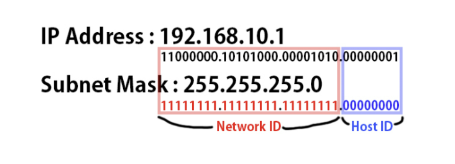

서브넷 마스크를 알기 전에 우리는 **서브넷(Subnet)** 에 대해 알아야 한다.

 

## 서브넷 (Subnet)이란?

서브넷(Subnet) 은 하나의 큰 네트워크를 여러 개의 작은 네트워크로 나누는 것을 말한다.  
이렇게 나누는 이유는 IP 주소의 낭비를 줄이고, 네트워크를 효율적으로 관리하기 위함이다.  

예를 들어, 어떤 회사가 1,000개의 컴퓨터를 갖고 있다고 해도, 이 컴퓨터들이 모두 하나의 네트워크에 속한다면  
브로드캐스트가 많아져서 네트워크 효율이 떨어질 수 있다.  
그래서 회사는 이 네트워크를 부서 단위로 나누어 여러 개의 소규모 네트워크(서브넷)로 구분한다.

 

## 서브넷 마스크(Subnet Mask)란?

**서브넷 마스크(Subnet Mask)** IP 주소에서 네트우크 부분과 호스트 부분을 구분하기 위한 32비트 숫자이다.

IP 주소는 네트워크 주소와 호스트 주소로 나뉘는데, 서브넷 마스크가 이 경계를 정해준다.

