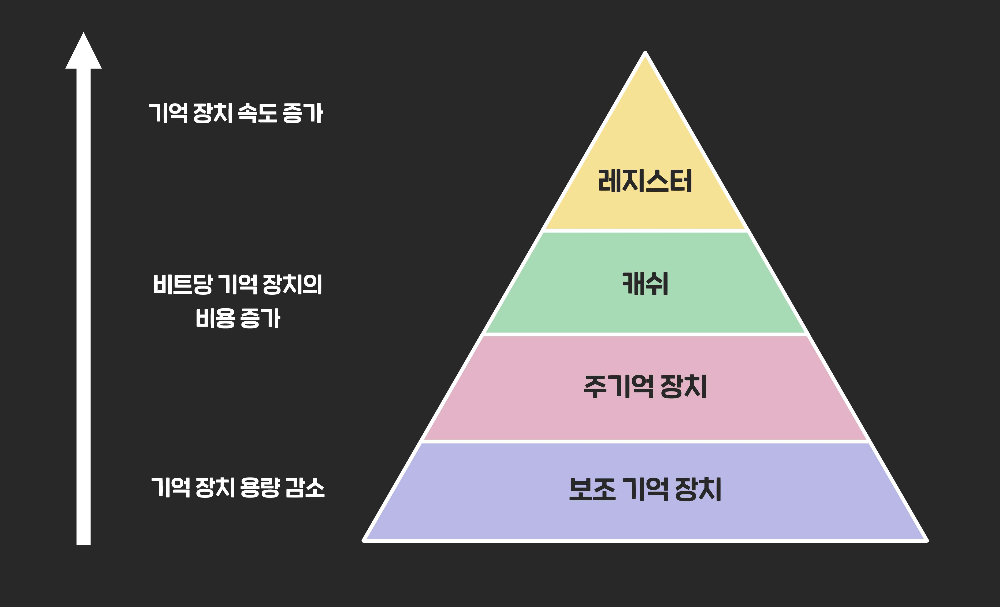

# 메모리 계층(Memory Hierarchy)이란?

**메모리 계층 구조**란 컴퓨터 시스템에서 다양한 속도와 크기를 가진 저장 장치들을 계층적으로 배치한 구조를 의미한다.  

이 구조는 **속도는 빠르지만 용량이 작은 고속 메모리**부터 **속도는 느리지만 용량이 큰 저장 장치**까지 효율적으로 구성되어 있다.

<br>

## 메모리 계층 구조의 구성



메모리 계층 구조는 일반적으로 위 그림과 같이 구성되며, 상위로 갈수록 속도는 빠르지만 <br>
 용량이 작고 비용이 높으며, 하위로 갈수록 속도는 느리지만 용량이 크고 비용이 저렴하다.

### 1. 레지스터 (Register)
- CPU 내부에 위치해있다.
- 가장 빠르며, 용량이 매우 작다.
- 산술 및 논리 연산에 직접 사용된다.

### 2. 캐시 메모리 (Cache)
- CPU와 주기억장치(RAM) 사이에 위치해 있다.
- 접근 속도가 빠른 메모리로, 자주 사용하는 데이터를 임시로 저장한다.
- L1, L2, L3 등으로 나뉜다. (L1이 가장 빠름)

### 3. 주기억장치 (Main Memory, RAM)
- 프로그램 실행 시 데이터를 저장하는 공간이다.
- 속도는 느리지만 용량은 크다.
- 전원이 꺼지면 데이터가 사라지는 휘발성 메모리이다.


### 4. 보조기억장치 (Secondary Storage)
- 하드 디스크, SSD 등이 보조기억장치에 포함된다.
- 가장 느리고, 용량이 매우 크다.
- 장기 보관용으로 쓰인다.

## 메모리 계층의 목적

### 1. 속도와 비용의 균형
- 고속 메모리는 빠르지만 가격이 비싸고 용량이 작다.
- 저속 메모리는 느리지만 가격이 저렴하고 용량이 크다.
- 이 둘을 적절히 조합해 시스템의 전체 성능을 높이면서 비용을 최소화할 수 있다.

### 2. 시스템 성능 최적화
- CPU는 빠른 연산 능력을 가지고 있기에, 느린 메모리만 사용할 경우 병목 현상이 발생한다.
- 속도가 빠른 상위 계층에 자주 사용하는 데이터를 저장함으로써 데이터 접근 시간을 줄이고 처리 속도를 향상시킬 수 있다.


<br>

```
병목 현상이란? : 한 부분의 처리 속도가 느려서 전체 시스템의 성능이 그 부분에 의해 제한되는 상황
```

### 3. 지역성(Locality)의 원리 활용
- 대부분의 프로그램은 다음 두 가지 지역성 원리를 따른다:

    - 시간 지역성: 최근에 사용된 데이터는 가까운 미래에도 사용될 가능성이 높음

    - 공간 지역성: 인접한 데이터가 함께 사용될 가능성이 높음


- 이러한 지역성에 기반해 자주 접근하는 데이터를 빠른 계층에 배치함으로써 효율적인 메모리 관리를 할 수 있다.

### 4. 자원의 효율적 활용
- 모든 데이터를 빠른 메모리에 저장하는 것은 비효율적이다.
- 계층으로 나누면서 필요한 데이터를 적절한 계층에 저장하고, 관리할 수 있어 자원을 효율적으로 활용할 수 있다.